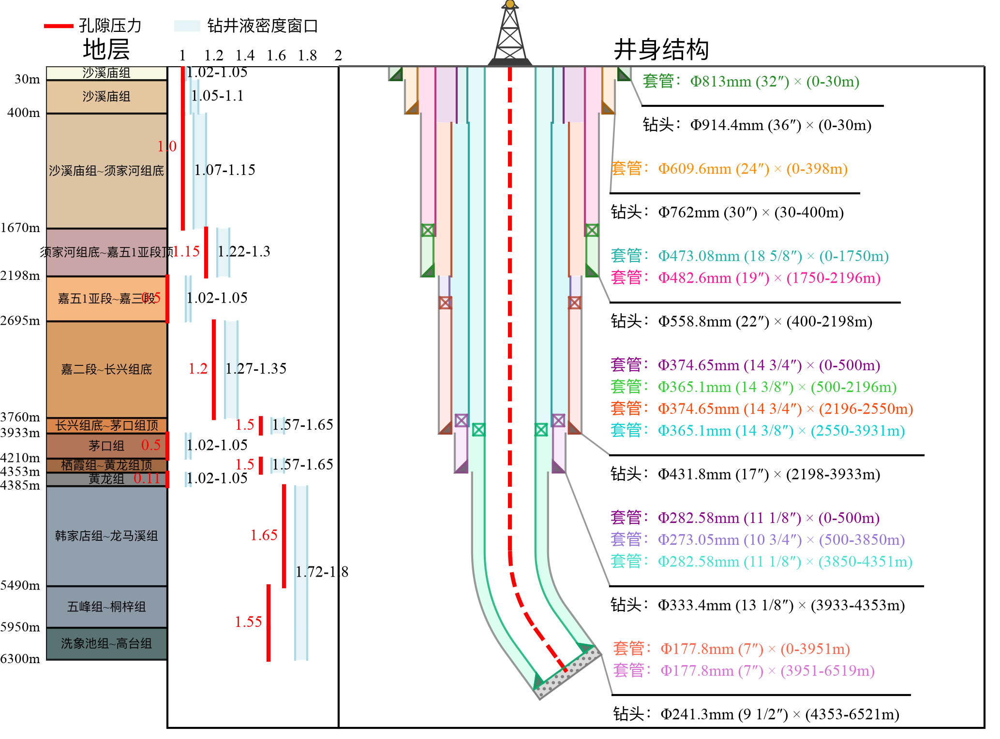

# Awesome Well Structure MCP 服务

基于 MCP (Model Context Protocol) 协议 的井身结构图生成服务：提交井数据，等待渲染，读取生成的井身结构图。

服务以 **Streamable HTTP** 方式托管，客户端直接连接公网地址即可，无需在本地安装任何程序。由西南石油大学钻井所，何世明——汤明实验室团体提供技术支持。

This service, powered by the Model Context Protocol (MCP), automatically generates borehole structure diagrams from well data. It is technically supported by the He Shiming and Tang Ming research group at the Drilling Research Institute of Southwest Petroleum University.

问题反馈：1873475824@qq.com（陈春钱）

## 示例图片

井身结构示意图绘制：



## 服务地址

| 项 | 值 |
|---|---|
| MCP 端点 | `https://ccqwell.vip.cpolar.cn/mcp` |
| 传输方式 | Streamable HTTP |
| 认证 | Bearer Token（每个请求都必须携带） |
| 输入契约 | **YAML**（不接受 JSON） |
| 输出格式 | PNG / SVG |

配置说明的在线版本见 <https://ccqwell.vip.cpolar.cn/mcp-setup>。

## 快速开始

### 第一步：生成 API Key

登录后前往 <https://ccqwell.vip.cpolar.cn/keys> 生成密钥。

**明文只显示一次，请立即保存。**

### 第二步：选择认证方式

客户端必须随每个 MCP 请求发送 Bearer Token。两种做法：

- **环境变量**（更安全，推荐）—— 密钥不落盘到仓库，也不会被 `git commit` 带走。
- **项目配置中的固定请求头** —— 适合无法继承终端环境的桌面客户端。

### 第三步：新建会话验证

保存配置后**新建**客户端会话。已有会话不会重新加载 MCP 工具；仅看到配置显示为 `enabled` 也不代表连接成功。

## Claude Code 配置

### 推荐：使用 CLI 添加

```bash
export WELLBORE_API_KEY='粘贴你的 API Key'
# PowerShell：$env:WELLBORE_API_KEY='粘贴你的 API Key'
```

```bash
claude mcp add --transport http --scope user wellbore \
  https://ccqwell.vip.cpolar.cn/mcp \
  --header 'Authorization: Bearer ${WELLBORE_API_KEY}'
```

`user` 作用域会在本机所有项目中启用。只想给当前项目使用时改成 `local`；团队共享配置时使用 `project`。

### 配置文件：使用 `.mcp.json`

在项目根目录创建 `.mcp.json`。仓库内提供了 [`.mcp.json.example`](./.mcp.json.example) 可直接复制：

```json
{
  "mcpServers": {
    "wellbore": {
      "type": "http",
      "url": "https://ccqwell.vip.cpolar.cn/mcp",
      "headers": {
        "Authorization": "Bearer ${WELLBORE_API_KEY}"
      }
    }
  }
}
```

配置可以提交，但**不要提交密钥**；运行 Claude Code 前设置好环境变量。

### 作用域

| 作用域 | 生效范围 | 配置文件位置 |
|---|---|---|
| `local` | 默认值；仅当前项目 | `~/.claude.json` |
| `project` | 仅当前项目，可与团队共享 | 项目根目录的 `.mcp.json` |
| `user` | 本机所有项目 | `~/.claude.json` |

### 检查与管理

```bash
claude mcp list
claude mcp get wellbore
# 进入 Claude Code 后也可运行 /mcp
claude mcp remove wellbore --scope user
```

若使用了其他作用域，移除时把 `user` 换成对应的 `local` 或 `project`。

## Codex 配置

### 项目级：使用 `.codex/config.toml`

在受信任仓库的根目录创建 `.codex/config.toml`。固定请求头不依赖桌面应用是否继承终端环境。

```toml
[mcp_servers.wellbore]
url = "https://ccqwell.vip.cpolar.cn/mcp"
http_headers = { Authorization = "Bearer 粘贴你的 API Key" }
tool_timeout_sec = 180
```

> **此文件含明文密钥，必须加入 `.gitignore`，不要提交或分享。** 本仓库的 `.gitignore` 已默认忽略该路径。

项目未被 Codex 信任时，项目级配置不会加载。

### 更安全：使用环境变量与 CLI

```bash
export WELLBORE_API_KEY='粘贴你的 API Key'
codex mcp add wellbore \
  --url https://ccqwell.vip.cpolar.cn/mcp \
  --bearer-token-env-var WELLBORE_API_KEY
```

CLI 将服务器写入用户级 `~/.codex/config.toml`，适用于所有项目。密钥必须存在于启动该 Codex 会话的环境中；macOS 终端里的 `export` 不会自动传给从 Dock 启动的桌面应用。

### 加载规则

1. `.codex/config.toml` 只影响当前受信任仓库；`~/.codex/config.toml` 是当前用户的全局配置。
2. CLI 与 IDE 使用相同的配置层，但环境变量仍以各自会话实际继承到的值为准。
3. 保存或修改配置后新建会话；已有会话不会动态增加新工具。

### 检查与管理

```bash
codex mcp list
codex mcp get wellbore --json
# 进入 Codex TUI 后也可运行 /mcp
codex mcp remove wellbore
```

`list` 与 `get` 用于核对配置；最终仍需在新会话中成功发现并调用工具，才能确认连接可用。

## 工具与资源

### 工具

| 工具 | 用途 |
|---|---|
| `submit_job` | 提交井身结构图 YAML，同步校验后进入渲染队列 |
| `wait_for_job` | 等待 job 发生一次状态变化或到达终态 |
| `get_structure_diagram` | 读取主图（PNG 返回图片内容，SVG 返回原图字节） |
| `get_job_status` | 查询 job 当前状态，成功时返回规范 JSON 与主图 Resource URI |
| `list_jobs` | 列出当前账户最近提交的 job |
| `cancel_job` | 取消自己的 queued job |
| `get_render_meta` | 查询主图 sha256、ETag、字节数、PNG 宽高与生成时间（不返回图片字节） |
| `list_renders` | 列出已落盘的规范 JSON 与主图资源 |
| `get_structure_diagram_chunk` | 断连续传：按字节偏移分块读取主图 |
| `get_yaml_help` | 读取 YAML 指南／示例／模板（供不支持 Resources 的客户端） |
| `get_normalized_json` | 读取成功 job 的规范 JSON（供不支持 Resources 的客户端） |

典型链路：`submit_job` → `wait_for_job` → `get_structure_diagram`。

> 完整工具清单以新会话中客户端实际发现的结果为准（也可读取 `wellbore://meta`）。

### Resources

| URI | 内容 |
|---|---|
| `wellbore://yaml/guide` | YAML 输入指南（权威契约说明） |
| `wellbore://yaml/examples` | 按目标画面组织的最小输入示例 |
| `wellbore://yaml/template` | 可直接修改的完整 YAML 模板 |
| `wellbore://meta` | 服务元信息 |
| `wellbore://jobs/{job_id}/well_data.normalized.json` | 该 job 的规范 JSON |
| `wellbore://jobs/{job_id}/well_structure_plot.png` | 该 job 的主图（PNG） |
| `wellbore://jobs/{job_id}/well_structure_plot.svg` | 该 job 的主图（SVG） |

## 输入契约：只写 YAML

`submit_job` **只接收 YAML，不要提交 JSON**。字段规范以服务端提供的 `wellbore://yaml/guide` 为准——该文档随服务版本更新（当前 `YAML_SCHEMA_VERSION = 2026-09-28`），本仓库不再复制一份，以避免二次过期。

核心原则：**只写这张图真正需要的块**。YAML 顶层没有写出的块会被编译成"不在场"，因此不要为了"完整"补无关块——块一旦在场，就会启用它自己的必填字段与跨块校验。

六个绘图块：

| 块 | 说明 |
|---|---|
| `wellInfo` | 井的基本信息。短写法一行 `井名: 井斜角` |
| `keyPoints` | 轨迹关键点。短名 `keypoint`、`A`、`B` |
| `stratigraphy` | 地层栏，写成 `地层名: 底深` |
| `drillingFluidAndPressure` | 钻井液栏，每行 `[底深, 孔隙压力, [窗口下限, 窗口上限], 破裂压力?]` |
| `holeSections` | 井筒与套管。开次 `sec` 与套管 `cas` |
| `pilotHoleGuideLine` | 导眼辅助线，可写 `auto` 或 `null` |

最小示例（只画地层）：

```yaml
stratigraphy:
  遂宁组: 150
  沙溪庙组: 1112
```

提交时同步校验，错误直接返回带 `path`/`line` 的 422；合法输入才进入渲染队列。建议提供 `idempotency_key` 并在超时重试时复用：同账户同键同输入返回原 job，换 YAML 或格式返回 409。

## 端到端检查

新开一个客户端会话，然后发送下面这句话。服务应完成"读取指南 → 提交 → 等待 → 返回结构图"的完整链路：

> 请读取 wellbore://yaml/guide，然后用模板生成一张 PNG 井身结构图。

## 故障排查

| 现象 | 原因与处理 |
|---|---|
| **401** | API Key 缺失、错误或已撤销 |
| **403 / 421** | 服务端 Host 或 Origin 白名单未包含当前公网域名 |
| **连接正常但等待超时** | Codex 保留 `tool_timeout_sec = 180`；Claude Code 可再次调用等待工具 |
| **配置后看不到工具** | 确认项目已受信任并新建会话；使用环境变量认证时，还要确认该会话确实继承了密钥 |
| **显示 `enabled` 但无法调用** | `enabled` 只说明配置没有被禁用，请继续检查新会话中的实际工具列表与连接错误 |
| **提交返回 422** | YAML 校验未通过，按返回的 `path` / `line` 修正；契约见 `wellbore://yaml/guide` |

## 保护你的 API Key

- 不要把密钥放进 URL、提交到版本库或发给他人。
- 每个客户端建议使用独立密钥；停用设备时，到 <https://ccqwell.vip.cpolar.cn/keys> 单独撤销即可。
- 本仓库的 `.gitignore` 已默认忽略 `.mcp.json` 与 `.codex/config.toml`，避免误提交。

## 获取内测资格或提交反馈

联系：1873475824@qq.com —— 陈春钱 · 博士

## License

**非商业许可（Non-Commercial）** —— 详见 [LICENSE](./LICENSE)。

- ✅ **允许**：个人学习、研究、实验；高校与科研机构的非营利教学与学术研究。可复制、修改、再分发，需保留版权声明。
- ❌ **禁止**：任何商业用途，包括集成进营利性产品/服务、商业项目交付、企业内部生产经营使用、收费分发等。

本许可同样约束**托管服务及其生成的成果**：通过本服务生成的井身结构图等，仅限非商业用途。

商业授权请联系：1873475824@qq.com
